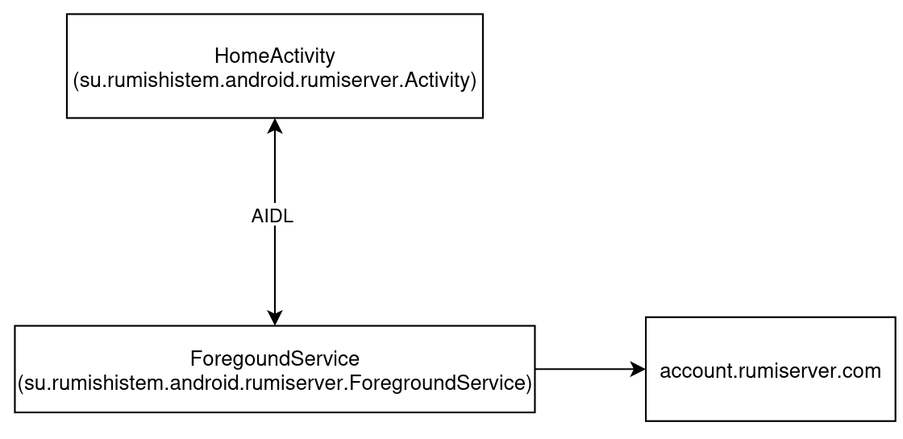

# RumiserverAndroid
るみさーばーのAndroid版アプリです、 
現状ログイン以外なにも出来ません。 

# 仕組み
AIDLを使用して、ユーザー情報や通知を取得します。 
AIDLに接続できるアプリは制限されます 

ForegoundServiceはるみ鯖APIとの仲介役です。 
ちなみにコイツがWebSocketにも常時接続しています。 

# 言語
Javaのみ、Kotlinは私が読めないのでやめてください。 

# コントリビュート
問題ありません。 
フォーマットは空気を読んでお願いします。 
別にこっちでフォーマット合わせるので問題はありません。 

# 改造/派生
どちらも問題ありません。 
BetterDiscordみたいなことをしても問題はありません。 

# ライセンス
未設定、後で設定します。 